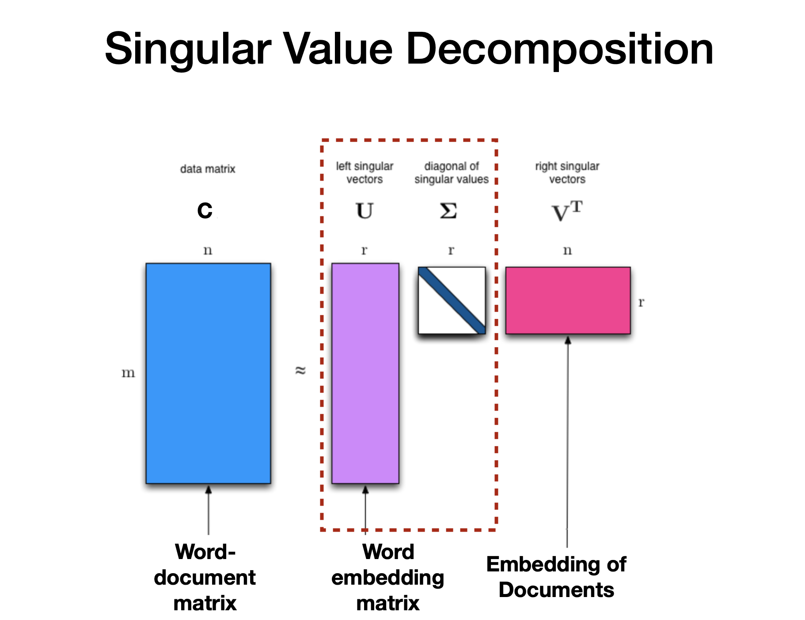

# Computational-mathematics-project
Decompositions in word embeddings

Word embeddings - это термин, используемый для представления слов для анализа текста, как правило, в виде реального вектора, который кодирует значение слова таким образом, что слова, которые ближе в векторном пространстве, будут похожи по смыслу.

Переходим к  разложениях в Word embeddings.

Представим наш корпус (набор текстов) в виде матрицы “слово-документ” (term-document). Эта матрица приводит нас к тематическим моделям, где матрицу “слово-документ” пытаются представить в виде произведения двух матриц “слово-тема” и “тема-документ”. Это делается при помощи SVD разложения, но у  SVD разложения несколько видов.

Наш эксперимент: берем матрицу и с помощью SVD-разложения получаем представление слов через темы(word embedding matrix) и документов через темы(embedding of documents).
Рассмотрим 3 возможных варианта SVD разложения(SVD full, SVD reduced, SVD randomized) и посмотрим, какой из них эффективнее(напишем SVD разложения сами)

Чтобы получить нашу матрицу «слово-документ», мы использовали библиотеку Sklearn(https: //scikit-learn.org/0.19/datasets/twenty_newsgroups.html)

Также провели предварительную обработку данных -  разделили текст на предложения, а предложения на слова. Сделали все буквы маленькими и удалили знаки препинания(Лексемезация) и слова, содержащие менее 3 символов.
Использовали метод Sklearn CountVectorizer, его гиперпараметры:
* tokenizer = LemmaTokenizer (): предварительная обработка текста,удаление любого слова длиной менее 3 символов и стоп-слов
* max_df = 0.9: любое слово с частотой выше 90% выбрасывается
* min_df = 5: любое слово, встречающееся менее 5 раз выбрасывается
Подробнее здесь: https://scikit-learn.org/0.20/modules/feature_extraction.html (4.2.3.10. Customizing the vectorizer classes)
Подробнее про Count Vectorizer: https://habr.com/ru/post/504744/

SVD разложение:
A - данные,матрица совпадений хэштег/слово(слова в виде строк, документы в виде столбцов) m*n
U - левые сингулярные вектора, embedding документов по словам, с которыми они совпадают m*r(word embedding matrix)
Sigma - диагональная матрицы с сингулярными числами r*r
V^T - правые сингулярные вектора, embedding слов по документам, с которыми они совпадают r*n(embedding of document matrix)

​

Также мы использовали библиотеку UMAP для того, чтобы представить наши темы на двумерной плоскости. Зададим количество соседей, равное 5, а остальные параметры оставим по умолчанию. 
Подробнее про UMAP : https://habr.com/ru/company/newprolab/blog/350584/

Цвет-это категория(нам нужна для проверки). Из графика мы видим, что наши слова почти верно распределились по категориям.
